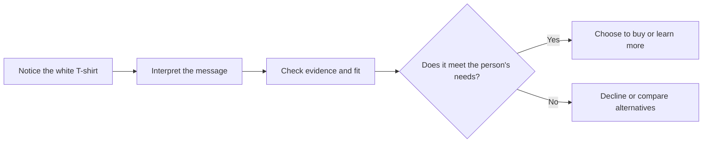

# Chapter 1: Persuasion and Human Decision-Making

Persuasion is part of ordinary life. A poster asks us to attend an event, a product page asks us to buy, and a public-health campaign asks us to wear a seat belt. In branding and design, persuasion is the deliberate work of shaping what people notice, how they interpret it, whether they trust it, and what they choose to do next.

That definition matters because persuasion does not mean making people do something against their will. Good persuasion helps people make an informed choice; it makes a useful option easier to understand, evaluate, and act on.

## One Shirt, Different Meanings

Imagine a plain white T-shirt: same cotton, same cut, same price.

- A basic store label might call it **"Everyday white crewneck."** This frames it as practical and familiar.
- A sustainable brand might explain its fabric, factory standards, and expected lifespan. This frames it as a responsible purchase, if those claims are true.
- A fashion brand might photograph it with a stylish outfit and call it **"The essential layer."** This frames it as a versatile part of a look.
- A campus organization might print a small event logo on it. Now it can signal belonging and shared identity.

The shirt has not physically changed. The message has changed what features receive attention and what the shirt *means* to a possible buyer. Framing can be useful, but it cannot ethically turn a low-quality shirt into a high-quality one or hide relevant information.

## Persuasion, Manipulation, and Coercion

| Approach | What it does | Does the person have a meaningful choice? | White T-shirt example |
| --- | --- | --- | --- |
| Persuasion | Gives relevant reasons and presents an option clearly. | Yes. The person can decline with reasonable understanding. | Showing accurate fit photos, material information, and care instructions. |
| Manipulation | Steers a choice by hiding, distorting, or exploiting information or emotions. | Technically yes, but the choice is unfairly shaped. | Calling a thin shirt "premium" while concealing that it shrinks heavily after one wash. |
| Coercion | Uses a threat, force, or serious penalty to obtain compliance. | No meaningful choice. | Telling an employee they will lose their job unless they buy the shirt. |

The line is not always about whether a designer wants a sale. It is about the means used. Urgency can be persuasive when a sale truly ends tonight; it becomes manipulative when a fake countdown resets every day.

## Cialdini's Principles of Influence

Psychologist Robert Cialdini describes several common patterns that influence decisions. These principles explain tendencies, not magic buttons. They are most responsible when they help people notice genuine value rather than bypass careful judgment.

| Principle | Mechanism | Ethical use | Misuse risk |
| --- | --- | --- | --- |
| Reciprocity | People often want to return a real favor. | Offer a useful sizing guide before asking for an email address. | Making a trivial "gift" create pressure for an unrelated purchase. |
| Commitment and consistency | People prefer actions that fit prior values or commitments. | Let a shopper save a preferred size or style. | Turning a small click into hidden enrollment or a difficult cancellation. |
| Social proof | When uncertain, people look to others' behavior. | Show verified reviews and accurate stock counts. | Using fake reviews, invented popularity, or misleading testimonials. |
| Authority | Credible expertise can make information easier to trust. | Use qualified sources for fabric-care or accessibility advice. | Using credentials, uniforms, or jargon to imply expertise that is not there. |
| Liking | We are more open to people or brands we find relatable. | Use an honest, welcoming brand voice. | Pretending a brand is a person's friend to extract data or money. |
| Scarcity | Limited availability can make an option feel more valuable or urgent. | State a real limited run or an actual deadline. | Creating false scarcity or hiding that more items will be restocked. |
| Unity | Shared identity can create trust and cooperation. | Design a shirt that genuinely supports values held by a campus group. | Pressuring people with "people like us buy this" messages. |

## Two More Ideas That Help Explain Decisions

### Framing and reference points

People do not react only to facts; they react to how facts are presented and compared. A shirt described as "$20, designed for repeated wear" invites a different evaluation from "only $20 today." Neither sentence is automatically dishonest, but each directs attention to a different reference point: durability in the first case and short-term price in the second.

Use framing to clarify the decision, not to conceal its costs. If the shirt is $20 plus shipping, the full cost belongs near the price.

### Cognitive ease

People are more likely to consider information that is easy to read, locate, and understand. Clear headings, legible type, plain language, and a visible return policy reduce unnecessary effort. This is not "dumbing down" an audience. It respects their time and lets them spend their attention on the real decision.

For the T-shirt page, place the size chart, fabric content, care instructions, price, and shipping information where a shopper can find them without a scavenger hunt.

### Ethos, logos, and pathos

Rhetoric offers a useful three-part check on a message:

- **Ethos** is credibility: Why should someone trust this brand or speaker?
- **Logos** is reasoning and evidence: What facts support the claim?
- **Pathos** is emotion: What feeling or value does the message connect to?

A good T-shirt campaign might use ethos by naming the manufacturer accurately, logos by giving fabric and care details, and pathos by showing the comfort of an easy everyday outfit. Emotion is not unethical by itself. The problem begins when emotion is used to distract from important facts.

## A Simple Decision Journey

Persuasion has a proper role at every early stage: it can help someone notice the product, understand its possible value, and find reliable evidence. It should not erase the final choice or make declining needlessly difficult.

## Ethical Cautions

Designers often have more information and more control over the interface than the audience. That creates responsibility. Do not hide fees, use confusing opt-outs, invent endorsements, make unsupported environmental claims, or design shame and panic into a decision. Be especially careful when the audience is young, stressed, financially vulnerable, or has limited time to compare options.

An ethical message can still be memorable, emotional, and commercially successful. Its test is whether a reasonable person would feel respected after learning the full story.

## Questions to Ask Before Trying to Persuade

1. What decision am I asking someone to make?
2. What information would they reasonably need to make that decision well?
3. Is every important claim accurate, supportable, and easy to find?
4. Am I using urgency, popularity, authority, or identity because it is true and relevant?
5. Can a person say no, leave, or cancel without confusion, shame, or penalty?
6. Would I be comfortable explaining this design choice to the person affected by it?
7. Does the message serve the audience's interests as well as the organization's goal?

## Explore Further

If you want to investigate these ideas more deeply, search for:

- `Robert Cialdini principles of influence reciprocity social proof`
- `choice architecture behavioral economics ethical design`
- `framing effect psychology examples`
- `ethos logos pathos rhetoric`
- `dark patterns consumer design`

## What You Should Remember

Persuasion shapes attention, interpretation, trust, and action, but ethical persuasion preserves an informed, meaningful choice. The same plain white T-shirt can be framed as practical, sustainable, fashionable, or communal without changing the product. Use influence principles and clear design to reveal real value; never use them to hide the truth, manufacture pressure, or trap people into a decision.
