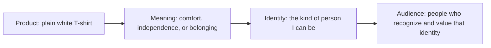

# Chapter 2: Brand Archetypes and Meaning

A product rarely succeeds because of its physical features alone. People also choose what a product lets them express, imagine, or join. Brand archetypes are a practical framework for planning that layer of meaning. They are generalized cultural and narrative patterns—familiar roles such as the Explorer, the Caregiver, or the Rebel—that make a brand's voice and promises easier to recognize.

The most useful question is not, "Which label is this brand?" It is:

> **What does the audience get to feel, imagine, or become by choosing this brand?**

An archetype gives a design team a starting point for answering that question consistently across language, images, product choices, customer service, and events.

## From Product to Meaning

The diagram is not a guarantee that everyone will respond the same way. It shows how a designer can move from a physical object toward an intended relationship with an audience.

## A Useful Set of Archetypes

The following set appears often in brand strategy discussions. Treat it as a vocabulary, not a scientific test or a complete map of every culture.

| Archetype | Core promise or feeling | A design direction | White T-shirt possibility |
| --- | --- | --- | --- |
| Explorer | Freedom, discovery, self-direction | Open spaces, motion, practical detail | A durable travel layer for an unplanned weekend away. |
| Sage | Understanding, clarity, competence | Calm structure, evidence, precise language | A carefully explained shirt: fiber content, fit notes, and care information. |
| Creator | Expression, originality, making | Customization, bold process, creative tools | A blank canvas shirt intended for screen printing or drawing. |
| Ruler | Control, status, confidence | Order, polish, exacting standards | A sharply styled essential presented as part of a composed wardrobe. |
| Caregiver | Support, safety, generosity | Warmth, accessibility, service | A soft, easy-care shirt packaged with clear help for finding the right size. |
| Rebel | Independence, disruption, refusal | Contrast, direct language, rule-breaking | A stripped-down shirt campaign that rejects flashy logos and trend chasing. |
| Hero | Achievement, courage, improvement | Progress, challenge, energy | A reliable training layer for people working toward a difficult goal. |
| Everyperson | Belonging, practicality, being understood | Familiar scenes, plain language, inclusiveness | An affordable everyday shirt for a shared campus activity. |
| Innocent | Simplicity, optimism, trust | Lightness, clarity, uncomplicated choices | A clean, straightforward shirt with a simple care routine. |
| Jester | Play, surprise, relief | Humor, bright interaction, lightness | A basic shirt sold with a funny removable tag or playful message. |
| Lover | Connection, beauty, sensory pleasure | Texture, intimacy, careful detail | A soft shirt styled for a favorite date-night outfit. |
| Magician | Transformation, possibility, wonder | Before-and-after stories, imaginative visuals | A shirt framed as the small starting point of a fresh personal style. |

The table describes possible directions, not facts about specific companies. A real design must still make promises it can keep.

## One Shirt, Dramatically Different Positions

Consider the same plain white T-shirt: identical fabric, cut, and price. These messages create different meanings without changing the shirt itself.

### Explorer: "Pack less. Go farther."

The page shows the shirt folded into a small travel bag and emphasizes easy layering. The audience is invited to imagine independence and an open itinerary. This position works only if its practical claims, such as durability or packability, are supported.

### Creator: "Start with a blank canvas."

The shirt is shown alongside fabric paint and printing tools. The audience gets to imagine becoming a maker whose own design finishes the product. Here, a truly plain shirt is an advantage rather than a missing feature.

### Everyperson: "The shirt you reach for first."

The tone is relaxed and direct. Photos show people wearing the shirt in ordinary settings: studying, commuting, or meeting friends. The audience is invited to feel included and understood, not pressured to become exceptional.

### Rebel: "No giant logo. No performance. Just a shirt."

The same item is positioned against excess branding and disposable trend cycles. The audience gets to imagine choosing for themselves rather than following a crowd. The message must avoid implying superiority without evidence.

These positions can lead to different copy, photography, packaging, and customer experience. They should not lead to false product claims. A T-shirt cannot honestly be promised as rugged adventure gear if it was not made to perform that role.

## Archetypes Are Not Destiny

Archetypes are patterns for communication, not rigid categories of human personality. No customer is simply "an Explorer," and no organization needs to live inside one label forever. A person may want the independence of an Explorer on a trip, the comfort of an Everyperson at school, and the care of a Caregiver during a stressful moment.

Brands can also combine tendencies. A community art center might be primarily a Creator, while using Caregiver qualities in its beginner-friendly classes. What matters is that the combination makes sense to the audience and does not produce contradictory promises.

Cultural context matters too. A symbol, color, joke, family role, or idea of status can carry different meanings across communities and places. Research with the actual audience, ask for feedback, and avoid assuming that a familiar pattern has the same meaning everywhere. Archetypes should sharpen curiosity about an audience, not replace it.

## Using the Framework Responsibly

Archetypes are especially helpful when a team has many design decisions to make. If a shirt is positioned through Caregiver values, for example, the easy-to-read size guide, reassuring return instructions, and helpful support should match the warm imagery. If the experience contradicts the message, the archetype becomes decoration rather than meaning.

Be careful with identity-based appeals. Do not use belonging to shame outsiders, use a community's imagery without understanding it, or promise transformation that the product cannot deliver. The audience should be able to recognize itself in the message without being boxed into it.

## Questions to Ask When Choosing an Archetype

1. What real benefit or experience can this product or organization honestly offer?
2. What does the audience get to feel, imagine, or become?
3. Which archetype helps explain that value most clearly?
4. Could a secondary archetype add depth without creating a confusing message?
5. How will the choice appear in words, visuals, service, and product decisions?
6. What cultural assumptions are we making, and who should review them?
7. Would this message still feel respectful if the audience knew all of the relevant facts?

## What You Should Remember

- Brand archetypes help turn products and experiences into recognizable invitations: an invitation to feel, imagine, or become something.
- They are flexible cultural and narrative patterns, not personality diagnoses or rules. 
- The same plain white T-shirt can suggest exploration, creativity, everyday belonging, or rebellion, but the chosen meaning must be supported by an honest product and respectful design.
