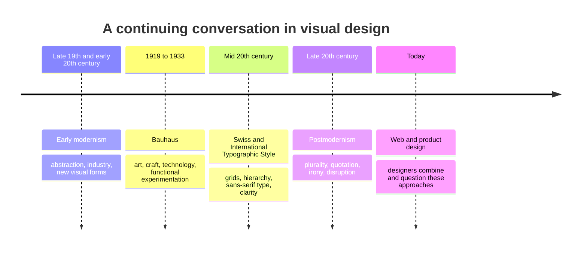

# Chapter 3: Design Language—Modernism, Postmodernism, and Meaning

Visual design carries ideas before a reader finishes a sentence. A strict grid can suggest order and competence. A crowded collage can suggest energy, protest, play, or overload. Neither approach is automatically better. Design language is the set of visual choices—type, color, space, images, layout, and materials—that helps an audience interpret what they are seeing.

Learning design history gives you more choices. It helps you recognize that a clean interface is not simply "neutral," and that a loud, expressive one is not simply "messy." Both belong to long conversations about what design should do.

## A Short Historical Path

Early modernism developed in the late nineteenth and early twentieth centuries, during periods of industrial change, new technologies, and experimentation in art and architecture. Many designers wanted visual forms that matched a changing world rather than copying older decoration. They explored abstraction, simplified forms, new materials, and more direct communication.

The **Bauhaus**, a German school active from 1919 to 1933, became an influential place for connecting art, craft, technology, and design education. Its teachers and students did not all share one look, but the school helped advance ideas about functional objects, geometric forms, material experimentation, and design for modern life.

After World War II, the **Swiss / International Typographic Style** developed especially in Switzerland and spread internationally. It emphasized structured grids, asymmetrical layouts, sans-serif type, photography, visual hierarchy, and clear information. Its aim was not merely to look minimal. It was to make communication orderly, legible, and broadly understandable.

By the later twentieth century, postmodern designers challenged the idea that clarity, reduction, and universal order should always be the highest goals. Postmodern work often welcomed plurality, historical quotation, irony, contradiction, decorative abundance, and expressive typography. It partly reacted against modernist certainty: the belief that a single rational system could suit every message, person, and place.

This is a timeline of influence, not a relay race in which one style replaces another. Modernist and postmodern ideas continue to overlap.

## A Product Can Speak in Different Visual Languages

Return to the plain white T-shirt. The object has the same fabric, cut, and price in both examples.

A **modernist presentation** might use a white background, a neat grid, one sans-serif typeface, generous empty space, and factual labels: size, fabric content, price, and care. The shirt can feel reliable, efficient, and carefully considered. Its message is: "Here is the product. The information is clear."

A **postmodern presentation** might layer oversized type, a clashing pattern, an ironic slogan, cropped photography, and unexpected colors around the same shirt. The shirt can feel playful, self-aware, or culturally specific. Its message may be: "This basic item is part of a bigger joke, mood, or identity."

The presentation changes expectations even though the T-shirt itself does not change. The ethical limit remains: visual language may shape interpretation, but it should not conceal the product's actual quality, cost, or conditions.

## The Continuing Tensions

| Tension | One end of the spectrum | The other end of the spectrum | Contemporary example |
| --- | --- | --- | --- |
| Order and disruption | Predictable alignment and repeated structure | Deliberate interruption, overlap, or surprise | A banking app may use steady layout; a music-event page may interrupt the grid to create excitement. |
| Universality and identity | Broadly familiar forms intended for many users | Local, community, or subcultural signals | A public-service form favors familiar controls; a neighborhood festival site may use language and visual references meaningful to its community. |
| Clarity and expression | Fast, direct reading | Type and imagery that communicate mood or character | A checkout page prioritizes clarity; a portfolio landing page may make visitors pause and explore. |
| Grid and anti-grid | Consistent columns and visual rhythm | Layering, collision, or irregular placement | A dashboard uses a grid to compare data; an editorial site may break it for a featured story. |
| Restraint and abundance | Limited colors, typefaces, and elements | Dense patterns, many references, or maximal detail | A settings screen stays restrained; a game launch page may use rich visual abundance. |
| Function and irony | A message designed to be literal and useful | A message that jokes, quotes, or questions itself | A transit alert gives direct instructions; a campaign poster may use irony to provoke thought. |

These are tensions, not two boxes. A designer may use a calm grid for navigation and an expressive banner for a campaign. The key question is whether each choice helps the audience understand, feel, or do what the design needs to support.

## Design History in Today's Screens

Modernist ideas are easy to find in contemporary web and product design: responsive grids, clear navigation, limited type systems, accessible contrast, and scannable information hierarchy. They are valuable when someone needs to complete a task quickly, such as checking out, scheduling an appointment, or reading a safety notice.

Postmodern impulses also remain visible: oversized or distorted type, mixed visual references, playful microcopy, unexpected animation, collaged image treatments, and brands that speak with self-aware humor. These approaches can make a digital experience distinctive and memorable.

Neither approach works everywhere. A highly expressive page may frustrate a person trying to find urgent information. A perfectly orderly page may feel generic when a cultural event needs character and warmth. Good design matches form to purpose, audience, and situation.

## How to Read a Design

Reading a design means observing its choices before deciding whether you like it. Start with these questions:

1. What do I notice first, second, and third? That is the visual hierarchy at work.
2. Where are the lines, columns, repeated alignments, or intentional breaks? This reveals the grid or anti-grid strategy.
3. Which typefaces, colors, images, and amounts of empty space set the mood?
4. What action does the design make easy, and what action does it make difficult?
5. Does it sound certain, playful, formal, rebellious, welcoming, or ironic? What visual evidence supports that reading?
6. Who seems included or addressed by this design? Who might find it confusing or unfamiliar?
7. Do the visual claims match the information and the actual experience being offered?

Try this with a website, package, poster, or campus sign. Describe the evidence first—"three columns, small black type, lots of white space"—then explain the meaning you infer. That makes your critique more precise than simply saying "it looks modern."

## Museum Research

Use museum and institutional collections to find authentic objects rather than relying on unlabeled images or social-media posts. Search within the collection sites of The Metropolitan Museum of Art, MoMA, Cooper Hewitt, the V&A, Bauhaus archives, or another credible museum, library, archive, or university collection. Verify the object record yourself: check its title, maker, date, medium, and collection information before using it in a project.

Useful search terms include:

- `Bauhaus poster typography collection`
- `International Typographic Style poster collection`
- `Swiss graphic design grid museum collection`
- `postmodern graphic design poster collection`
- `experimental typography museum collection`
- `modernist product design collection`

When you find an object, record what you can verify from its institutional record and then use the questions in the previous section to analyze its design language. Do not assume that an image reposted elsewhere has accurate attribution.

## What You Should Remember

- `Visual design carries ideas through choices about order, type, color, space, imagery, and tone. `
- `Modernism, Bauhaus, and the Swiss / International Typographic Style made clarity, grids, hierarchy, reduction, and function highly influential.` 
- `Postmodernism challenged the idea that those values should always dominate, making room for irony, expression, disruption, and many cultural voices.` 
- `Contemporary design still works within these tensions. Use the language that best serves the purpose and audience, while keeping the experience clear and honest.`
