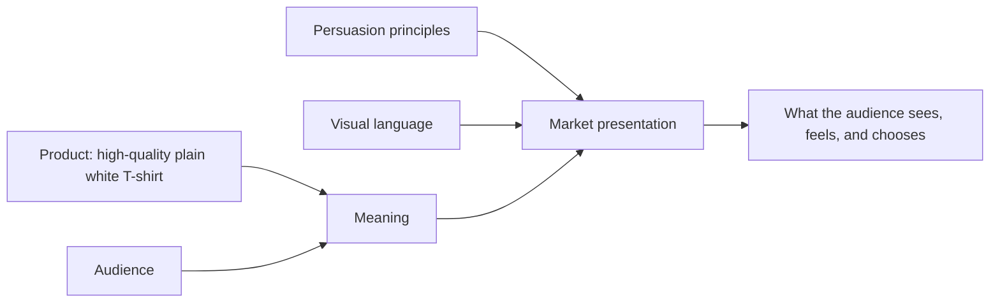

# Chapter 4: One White T-Shirt, Four Different Worlds

Meet our entire product line: one ordinary, high-quality plain white T-shirt. It has a comfortable cut, solid construction, and no logo. Its fabric, cut, price, and quality stay substantially the same in every concept below.

So why would anyone see it as a travel companion, a rational purchase, a joke, or a small act of care? Because a market presentation does more than show an object. It connects that object to a particular audience, a desired meaning, persuasive choices, and a visual language.

The shirt is the same. The invitation is not.

## Concept 1: The Carry-On Essential

**Headline:** *Pack less. Go farther.*

- **Audience:** Students and young adults who value independence, short trips, and flexible plans.
- **Chosen brand archetype:** Explorer.
- **Persuasion principles:** Commitment and consistency connects the shirt to the customer's self-image as someone who travels lightly; cognitive ease makes the choice feel simple with clear packing and care information. Scarcity should be used only for a real limited release or real deadline, never a fake timer.
- **Visual-design language:** Open landscape photography, roomy layouts, a practical typeface, and a muted palette that lets the white shirt stand out. The design feels like a field note, not a luxury catalog.
- **Short product story:** You are leaving Friday afternoon with one bag and no detailed itinerary. This is the reliable layer that goes under a jacket, over a swimsuit, and into the bottom of the bag without making a speech about itself.
- **Imagery direction:** A shirt folded beside a map, water bottle, train ticket, and worn sneakers; people in motion rather than posed models looking at the camera.
- **Meaning the customer is invited to buy:** "I am capable, mobile, and ready for an unplanned possibility."
- **Ethical concern or possible misuse:** The imagery must not exaggerate the shirt into technical outdoor gear. If it is simply a good everyday shirt, the presentation should say so.

## Concept 2: The Obvious Choice

**Headline:** *A shirt. Clearly made.*

- **Audience:** Busy shoppers who want dependable basics and dislike marketing noise.
- **Chosen brand archetype:** Sage, with a little Everyperson practicality.
- **Persuasion principles:** Authority comes from specific, supportable product information rather than an impressive-sounding spokesperson; cognitive ease comes from a visible size chart, care guide, price, and return details. The message also uses consistency: choosing a well-explained basic fits a customer's preference for thoughtful decisions.
- **Visual-design language:** Restrained modernist / Swiss-influenced design. Use a grid, black sans-serif type, precise labels, neutral photography, generous white space, and a small number of carefully ordered facts.
- **Short product story:** Nothing is hidden behind dramatic language. Here is the shirt, how it fits, how to care for it, and what it costs. The customer does not need a treasure map to find the important details.
- **Imagery direction:** A centered front and back view, close-up fabric detail, a simple fit diagram, and one calm everyday photograph. No artificial urgency badges or visual clutter.
- **Meaning the customer is invited to buy:** "I am making a sensible choice based on information I can understand."
- **Ethical concern or possible misuse:** Clean design can create an undeserved impression of superior quality. The facts, photos, and policy details must justify the confidence the layout suggests.

## Concept 3: The Extremely Serious Shirt

**Headline:** *Warning: may be mistaken for a personality.*

- **Audience:** Design students, nightlife regulars, and people who enjoy fashion with a wink.
- **Chosen brand archetype:** Jester, with Rebel energy.
- **Persuasion principles:** Liking works through a shared sense of humor; unity invites people into a group that recognizes the joke. Social proof could be used ethically through real customer photos or real event participation, but not invented hype.
- **Visual-design language:** Disruptive, postmodern anti-grid. Oversized type collides with tiny footnotes; the white shirt appears against clashing colors, crop marks, doodles, and knowingly dramatic captions. The layout seems to argue with itself.
- **Short product story:** This shirt is so plain that it loops around to being suspicious. Wear it with maximal confidence, or wear it while pretending you have never heard of confidence. Either way, the joke is that a basic item can carry a very elaborate attitude.
- **Imagery direction:** Flash photography, imperfect snapshots, a pile of laundry photographed like a museum display, and a model wearing the shirt with unexpectedly formal or theatrical styling.
- **Meaning the customer is invited to buy:** "I understand the joke, and I can make an ordinary thing feel like my own."
- **Ethical concern or possible misuse:** Insider humor can exclude people or make them feel uncool. The campaign should invite play rather than pressure people to prove that they belong.

## Concept 4: The First Thing You Reach For

**Headline:** *Comfort, without the ceremony.*

- **Audience:** People building an everyday wardrobe, including shoppers who value comfort, clear help, and low-pressure service.
- **Chosen brand archetype:** Caregiver.
- **Persuasion principles:** Reciprocity appears as genuinely useful help—a straightforward fit guide or care reminder—rather than a favor that creates obligation. Trust grows through transparent service information and a calm, respectful tone.
- **Visual-design language:** Warm editorial simplicity. Soft daylight, readable type, rounded but not childish details, generous spacing, and quiet colors. The layout is orderly, but it feels like a helpful room rather than a laboratory.
- **Short product story:** Some clothes ask to be noticed. This one is for getting on with your day: early class, laundry night, a long call with a friend, or a slow Sunday. It is a small piece of reliability when everything else is competing for attention.
- **Imagery direction:** Realistic domestic scenes: a chair with a book on it, sunlight near a window, friends cooking, or someone folding clean laundry. Show a range of people without treating diversity as decoration.
- **Meaning the customer is invited to buy:** "I deserve ease, and this brand is trying to make daily life a little easier."
- **Ethical concern or possible misuse:** A caring tone must not disguise poor customer service, difficult returns, or assumptions about family and home life. Care is demonstrated in the experience, not just pictured.

## Synthesis: Four Presentations, One Object

| Concept | Audience and archetype | Main persuasive approach | Visual language | Meaning offered | Risk to watch |
| --- | --- | --- | --- | --- | --- |
| The Carry-On Essential | Independent travelers; Explorer | Self-image, ease, honest urgency when relevant | Spacious, practical, outdoors-oriented | Capability and freedom | Overstating everyday clothing as performance gear |
| The Obvious Choice | Information-focused everyday shoppers; Sage / Everyperson | Evidence, clarity, easy comparison | Restrained modernist / Swiss-influenced grid | Rational confidence | Letting minimalism imply quality not supported by facts |
| The Extremely Serious Shirt | Playful, style-aware audiences; Jester / Rebel | Humor, unity, authentic social proof | Postmodern anti-grid, collage, visual irony | Belonging through self-aware expression | Creating exclusion or fake cultural hype |
| The First Thing You Reach For | Comfort- and service-focused shoppers; Caregiver | Helpful reciprocity, transparent trust | Warm, calm editorial design | Everyday ease and being cared for | Using soft language to hide poor service |

## What This Case Study Shows

The concepts are not four different products. They are four different arguments about why the same product matters. The Explorer presentation says the shirt supports freedom. The Sage presentation says it supports good judgment. The Jester presentation says it supports playful identity. The Caregiver presentation says it supports comfort and ease.

That is why designers need to think beyond a logo or a headline. The product story, photography, interface, persuasive cues, and ethical choices all need to reinforce the same invitation. If the message says "clear and trustworthy" but the checkout hides fees, the presentation falls apart. If the message says "care" but support is impossible to reach, the audience will notice.

## What You Should Remember

- `One physical product can enter several different markets through different meanings. `
- `A strong presentation combines a specific audience, a believable archetype, responsible persuasion, and a visual language that fits the promise. `
- `Creativity is not permission to make claims the product cannot support. The best version makes its meaning clear while leaving the customer informed and free to choose.`
