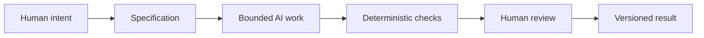

# Chapter 5: Directing AI with Meaning and Constraints

AI can produce a draft, a layout, a component, a test, or a whole list of options very quickly. Speed is useful, but it does not decide what should be made, whether a message is honest, or whether a result fits its audience. Those are direction problems.

The three ideas in this guide give you a high-level control framework for directing AI-assisted creative and technical work:

| Lens | Core question | What it helps direct |
| --- | --- | --- |
| Persuasion | What response are we trying to enable? | The audience's next step: understand, trust, compare, sign up, learn, or act. |
| Archetype | What meaning or identity are we expressing? | The role, feeling, and relationship the work should make possible. |
| Design language | How should that meaning look and feel? | Choices about layout, type, imagery, interaction, tone, and visual order. |

Together, these questions turn "make me a website" into something a person—or an AI—can work with. For example: "Help prospective students understand the program and request information. Make it feel knowledgeable and welcoming. Use a calm, clear, grid-based design with plain language and visible requirements." That is much more useful direction than "make it professional."

## From Intent to a Versioned Result

The arrows describe a workflow, not a handoff of responsibility. Human judgment is present throughout, especially when the work changes meaning, reaches an audience, or affects someone else's choices.

## Write a Specification Before You Ask for Work

A specification defines the boundaries of an AI task. It states what needs to be produced, where it belongs, what it must include, what it must not change, and how success will be checked. It reduces the chance that a broad request turns into a broad and surprising result.

For a small task, a specification might include:

- **Goal:** Add a clear enrollment section for prospective students.
- **Audience response:** Help them understand eligibility and choose whether to apply.
- **Meaning and tone:** Sage-like clarity with Caregiver-like support; no pressure or fake urgency.
- **Design direction:** Readable hierarchy, concise headings, and an accessible form.
- **Scope:** Change only the named page and its related test.
- **Acceptance checks:** Required fields are present, links work, tests pass, and the wording is reviewed by a human.

This does not make the task rigid in a bad way. It gives creativity a playing field. An AI can propose alternatives inside the boundary, while the team can compare those alternatives against a shared purpose.

## Why Git Matters

Git records versions of a project. For AI-assisted work, that record is especially valuable because a generated change can be large, quick, and difficult to reconstruct from memory.

With Git, a team can inspect what changed, compare a generated draft with the earlier version, connect a change to its task, and recover a known working version when needed. A commit is not proof that a change is good. It is a traceable checkpoint where people can ask: What changed? Why? Who reviewed it? Can we safely reverse it?

Use small, focused changes when possible. A focused change is easier to review and easier to undo than an AI-generated rewrite that touches unrelated files.

## Checks: Useful, but Not All-Powerful

**Deterministic automated checks** produce the same result when given the same input. Examples include a formatter, a unit test, a type checker, a link checker, or a test that confirms a required heading exists. They are cheap and repeatable, so run them often. If a test fails, it gives the team a concrete place to investigate.

They cannot decide whether a headline is misleading, whether an image stereotype is harmful, or whether a design feels right for a particular community. A passing check means the checked condition passed—not that every important question has been answered.

**AI review** can be useful in a different way. An AI can scan a draft for missing requirements, unclear wording, repeated ideas, possible edge cases, or inconsistencies with a specification. It can offer fast second opinions and generate questions a reviewer might otherwise miss. But its review is probabilistic: it may notice a problem, overlook a problem, or sound confident about a mistake. Treat it as an assistant that proposes review leads, not as a final authority.

## The Pit Stop: Why Human Review Still Matters

Think of an automated workflow as a race car moving quickly around a track. Sensors, dashboards, and automated systems keep the car running. But at selected moments, the car makes a pit stop. A skilled crew deliberately inspects the tires, fuel, damage, and strategy before sending it back out.

Human review is that pit stop. You do not need to examine every comma with a committee, but you should deliberately stop when the work has a meaningful consequence: publishing to an audience, changing a user flow, making a claim, handling personal data, merging a large change, or releasing a feature.

At the pit stop, humans remain responsible for judgment, meaning, truthfulness, context, and final decisions. Ask whether the result serves the intended audience, whether its claims are supportable, whether it excludes or harms anyone, and whether the tradeoffs are acceptable. AI can help prepare the car; people decide whether it should leave the pit lane.

## Using the Framework in Practice

Suppose you ask AI to draft a product page for the plain white T-shirt from earlier chapters.

1. Start with **persuasion**: Are you enabling a shopper to compare basics calmly, or inviting a traveler to imagine an easy trip?
2. Choose an **archetype**: Should the message feel like Explorer freedom, Sage clarity, Jester play, or Caregiver reassurance?
3. Choose a **design language**: Should the result use a restrained grid, open travel imagery, or an expressive anti-grid composition?
4. Bound the request with a specification: name the deliverable, audience, facts the page may claim, files in scope, and acceptance checks.
5. Run deterministic checks, then conduct a human pit stop before the work becomes a versioned result.

The framework does not make AI less creative. It gives creative output a purpose, a character, and a set of accountable limits.

## Questions for Next Week

1. What audience response would you want to enable in an AI-assisted project?
2. Which archetype would make that response feel meaningful, and which one would be misleading?
3. What design language would support the promise without getting in the way?
4. What facts, files, and acceptance checks belong in the task specification?
5. Where would you schedule a human pit stop, and what would the reviewer need to inspect?

## What You Should Remember

- Persuasion, archetypes, and design language give AI work direction: response, meaning, and form. 
- A clear specification keeps a task bounded; Git makes changes traceable and recoverable; deterministic checks provide cheap, repeatable evidence; and AI review can suggest useful leads without guaranteeing correctness.
- Humans remain responsible for what the work means, whether it is true and appropriate, and whether it should be released.
